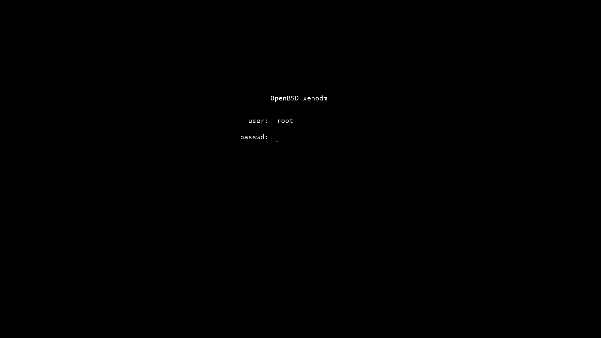
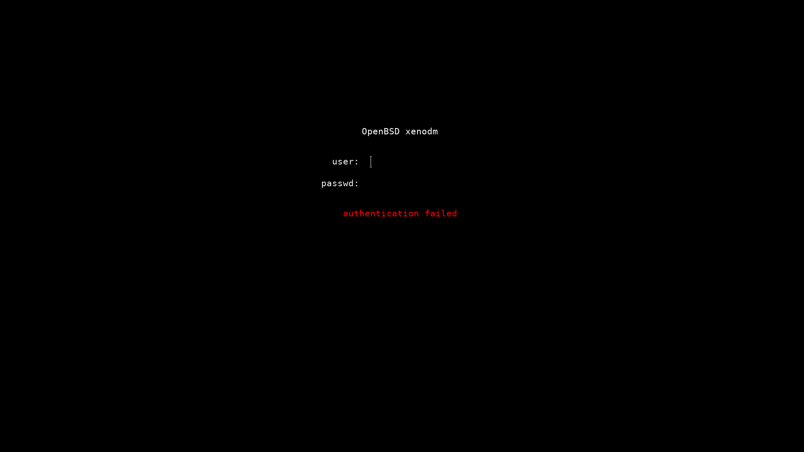

## xenodmrc
 a minimal OpenBSD xenodm config 
### Example installation
```
$ doas -s
# cd /etc/X11/xenodm
# mv Xresources Xresources.bak
# mv Xsetup_0 Xsetup_0.bak
# ftp -o Xresources https://raw.githubusercontent.com/lacamera/xenodmrc/master/Xresources  
# ftp -o Xsetup_0 https://raw.githubusercontent.com/lacamera/xenodmrc/master/Xsetup_0 
# chmod 444 Xresources
# chmod 755 Xsetup_0
```
### Screenshots


### License
This project is licensed under the BSD 2-Clause License - see the LICENSE file for details
